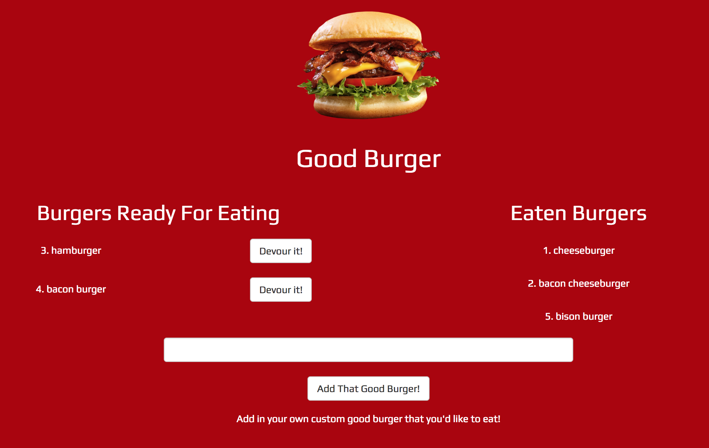

# goodburger2

Goodburger2 is a place where you can devour burgers, free of charge.

## Purpose
To follow the MVC design pattern, using sequelize to save and retrieve data to a SQL database. This is deployed to Heroku with JawsDB as the database.
 
## Screenshot

## Tech/framework used
<b>Built with</b>
- [Node.js](https://nodejs.org/en/)
- [MySQL](https://www.npmjs.com/package/mysql)
- [Express.js](https://www.npmjs.com/package/express)
- [Handlebars.js](https://www.npmjs.com/package/express-handlebars)
- [Moment.js](https://momentjs.com/)
- [body-parser](https://www.npmjs.com/package/body-parser)
- [Bootstrap](https://getbootstrap.com/docs/3.3/)
- [JawsDB](https://elements.heroku.com/addons/jawsdb)
- [Sequelize](https://www.npmjs.com/package/sequelize)
- HTML5, CSS3, Javascript and jQuery

## Features
Google Fonts and Bootsrap provide for a polished UI, and Heroku's hosting combined with JawsDB permit data persistent burgers.

## Installation
- Visit the deployed site at [Good Burger 2](https://damp-tor-93239.herokuapp.com/) for demo.
- Otherwise, fork or clone the GitHub repo to your machine.
- Ensure that you have Node.js and MySQL installed on your machine
- Set up the database using MySQL to run the schema.sql and seeds.sql files
- If you have a password that protects your MySQL root user, enter that password in the connection.js file in the cloned repo
- In your CLI, navigate to the cloned directory. Install the npm dependencies and start the server.

  `npm install`

  `node server.js`

This Project uses EditorConfig to standardize text editor configuration.
Visit [https://editorconfig.org/](https://editorconfig.org/)

This Project uses ESLint to detect suspicious code in JavaScript files.
Visit [https://eslint.org/](https://eslint.org/)
Run `npm run -s eslint .` to see ESLint errors and warnings.

This project uses gulp to convert sass into css files. To watch sass files, run `gulp` and edit the sass files, then save and see the css files in `/public/assets/css` have updated. This project hardly has any css in it, however this is a good intro to how gulp works and can convert sass into css.

- Good Burger 2 runs locally on port 8080. Open your favorite web browser and navigate to localhost:8080 and check out Good Burger!
